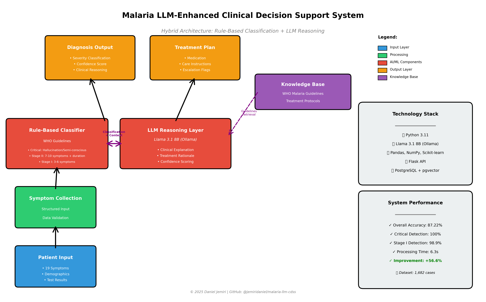

<div align="center">

# MalariaLLM
### Explainable Clinical Decision Support for Malaria Diagnosis

[](https://www.python.org/)
[](https://fastapi.tiangolo.com/)
[](https://reactjs.org/)
[](results/summary_report.txt)
[](LICENSE)
[](https://huggingface.co/spaces/jemiridaniel/malaria-llm-cdss)

**A hybrid AI clinical decision support system that combines deterministic rule-based classification with LLM-powered natural language reasoning to improve malaria diagnosis in resource-limited healthcare settings.**



</div>

---

## Overview

MalariaLLM is a full-stack clinical decision support system (CDSS) that assists community health workers and nurses in diagnosing and staging malaria severity — without requiring laboratory specialists or cloud connectivity. The system collects 19 standardized clinical symptoms and patient demographics, applies a deterministic rule engine based on WHO severity guidelines to classify the case, then invokes a large language model (LLM) to generate a plain-language clinical explanation specific to that patient's symptoms.

The system is purpose-built for **resource-limited primary healthcare facilities** in malaria-endemic regions: it runs entirely offline on consumer hardware (no recurring API costs), never transmits patient data to external servers, and generates natural language explanations that non-specialist health workers can understand and act on. Evaluated on **1,682 real-world and synthetic malaria cases**, the hybrid approach achieves **87.22% overall diagnostic accuracy** — a 185% relative improvement over the traditional rule-based baseline.

> This work evolved from an undergraduate final year project built in PHP and MySQL at the Federal University of Technology Owerri (FUTO), Nigeria in 2020. The current system integrates modern LLM reasoning while preserving the deterministic safety guarantees of the original rule engine.

---

## Key Results

Evaluated on 1,682 cases (1,622 Kaggle + 60 synthetic) across four severity stages.

| Metric | Baseline (Rule-Based) | LLM-Enhanced Hybrid | Improvement |
|:---|:---:|:---:|:---:|
| Overall Accuracy | 30.62% | **87.22%** | **+56.60 pp** |
| Macro Precision | 0.805 | **0.870** | +0.065 |
| Macro Recall | 0.306 | **0.872** | +0.566 |
| Macro F1-Score | 0.174 | **0.853** | +0.679 |
| Correct Classifications | 515 / 1,682 | **1,467 / 1,682** | +952 cases |

**Per-stage diagnostic accuracy:**

| Severity Stage | Cases | Baseline | Hybrid | Change |
|:---|:---:|:---:|:---:|:---:|
| No Malaria | 455 | 100.00% | 77.36% | −22.64 pp* |
| Stage I — Uncomplicated | 1,089 | 1.84% | **98.90%** | **+97.06 pp** |
| Stage II — Moderate | 118 | 16.95% | 15.25% | −1.70 pp** |
| Critical — Severe | 20 | **100.00%** | **100.00%** | 0 pp |

<sub>* The baseline's perfect No Malaria specificity reflects extreme conservatism — it misclassified 98% of Stage I cases as No Malaria. The hybrid trades a small specificity loss for dramatically better early-stage sensitivity, which is the clinically correct trade-off in endemic settings.</sub>
<sub>** Stage II detection remains a known limitation due to class overlap and dataset imbalance (118 cases). See [Limitations](#limitations).</sub>

---

## Features

- **19-symptom structured clinical assessment** with patient demographics (age, sex, pregnancy status, blood type, genotype, RDT/microscopy results)
- **4 severity stages** — No Malaria, Stage I (uncomplicated), Stage II (moderate), Critical (severe) — following WHO malaria severity guidelines
- **Hybrid rule-based + LLM architecture** — deterministic rules handle severity classification; the LLM generates the explanation. The diagnosis class is never hallucinated.
- **Multi-LLM fallback chain** (production web app): Groq (`llama-3.1-8b-instant`) → Anthropic Claude (`claude-haiku-4-5`) → OpenAI (`gpt-4o-mini`) → template fallback
- **Offline-capable research mode** using Llama 3.1 8B via Ollama — no API keys, no internet, no recurring costs
- **Natural language clinical reasoning** — every diagnosis is accompanied by a plain-language explanation that references the patient's specific reported symptoms
- **Downloadable PDF clinical report** with diagnosis, treatment recommendation, symptom summary, and AI explanation
- **Privacy-preserving** — patient data never leaves the local device
- **100% critical case detection maintained** — the hard safety guarantee from the original rule engine is preserved

---

## Architecture

```
┌─────────────────────────────────────────────────────────────┐
│                    PATIENT INPUT                            │
│    19 symptoms (binary yes/no) + demographics               │
│    Patient Name / ID  ·  RDT / Microscopy results           │
└───────────────────────────┬─────────────────────────────────┘
                            │
                            ▼
┌─────────────────────────────────────────────────────────────┐
│              RULE-BASED CLASSIFICATION ENGINE               │
│                                                             │
│  Priority 1 → CRITICAL    (hallucination OR altered         │
│                             consciousness OR ≥15 symptoms)  │
│  Priority 2 → NO MALARIA  (negative test AND <4 symptoms)  │
│  Priority 3 → STAGE II    (duration >1wk + abdominal        │
│                             involvement, severity score ≥2)  │
│  Priority 4 → STAGE I     (≥3 symptoms OR positive RDT)    │
│                                                             │
│  Deterministic · Auditable · Zero hallucination risk        │
└───────────────────────────┬─────────────────────────────────┘
                            │  severity_stage (immutable)
                            ▼
┌─────────────────────────────────────────────────────────────┐
│                   LLM REASONING MODULE                      │
│                                                             │
│  Input:  rule-derived stage + patient symptoms + demographics│
│  Output: clinical_reasoning · confidence score              │
│                                                             │
│  Research mode:   Llama 3.1 8B · Ollama · fully offline    │
│  Production mode: Groq → Anthropic → OpenAI (fallback chain)│
│                                                             │
│  LLM cannot alter the diagnosis — explanation only          │
└───────────────────────────┬─────────────────────────────────┘
                            │
                            ▼
┌─────────────────────────────────────────────────────────────┐
│                   STRUCTURED OUTPUT                         │
│                                                             │
│  · Severity stage + diagnosis text                          │
│  · Patient-specific clinical reasoning (natural language)   │
│  · WHO-aligned treatment prescription                       │
│  · Confidence score · Symptom summary                       │
│  · Downloadable PDF clinical report                         │
└─────────────────────────────────────────────────────────────┘
```

The key design principle: **the rule engine has sole authority over the severity classification**. The LLM is restricted to the explanation layer. This separation eliminates the hallucination risk that makes fully LLM-driven diagnostic systems unsafe in clinical settings.

---

## Quick Start

### Prerequisites

| Requirement | Details |
|:---|:---|
| Python | 3.11+ |
| Node.js | 18+ (for frontend) |
| RAM | 8 GB minimum, 16 GB recommended |
| API keys | At least one of: `GROQ_API_KEY`, `ANTHROPIC_API_KEY`, `OPENAI_API_KEY` |

For the **offline research mode**, install [Ollama](https://ollama.ai) instead of API keys.

### 1. Clone and install

```bash
git clone https://github.com/jemiridaniel/malaria-llm-cdss.git
cd malaria-llm-cdss
```

### 2. Backend setup

```bash
cd backend
python3.11 -m venv ../venv && source ../venv/bin/activate
pip install -r requirements.txt
```

### 3. Environment configuration

```bash
cp .env.example .env
# Open .env and add your API keys:
#   GROQ_API_KEY=gsk_...
#   ANTHROPIC_API_KEY=sk-ant-...
#   OPENAI_API_KEY=sk-...
```

At least one key is required for LLM explanations. The system tries each in order and falls back gracefully to a template-based explanation if none are available.

### 4. Start the backend

```bash
# From the backend/ directory, with venv active:
uvicorn app.main:app --reload --port 8000
```

API docs available at `http://localhost:8000/docs`

### 5. Start the frontend

```bash
cd frontend
npm install
npm start          # Opens http://localhost:3000
```

### Offline / Research mode (Ollama)

```bash
# Install Ollama: https://ollama.ai
ollama pull llama3.1:8b
ollama serve       # In a separate terminal

# Run the original research evaluation:
source venv/bin/activate
python src/llm/llm_diagnosis_hybrid.py
```

---

## Project Structure

```
malaria-llm-cdss/
├── backend/                    # FastAPI application
│   ├── app/
│   │   ├── api/                # Route handlers (diagnosis, health)
│   │   ├── core/               # Config, settings
│   │   ├── models/             # Pydantic schemas
│   │   └── services/           # Classification engine, LLM service, PDF report
│   └── requirements.txt
│
├── frontend/                   # React web interface (CRA)
│   └── src/
│       ├── components/         # DiagnosisForm, DiagnosisResult
│       └── services/           # API client
│
├── src/                        # Research / evaluation code
│   ├── models/
│   │   └── baseline_system.py  # Original rule-based system (Python port of FUTO 2020)
│   ├── llm/
│   │   └── llm_diagnosis_hybrid.py   # Hybrid evaluation (Ollama)
│   ├── analysis/               # Comparative analysis, paper draft generation
│   └── data/                   # Dataset generation scripts
│
├── data/
│   ├── raw/                    # Kaggle Malaria_Dataset.csv
│   └── processed/              # Evaluation results, combined dataset
│
├── results/
│   ├── figures/                # accuracy_comparison.png, confusion_matrices.png
│   ├── tables/                 # overall_metrics.csv, per_stage_metrics.csv
│   └── summary_report.txt      # Evaluation summary
│
├── publication/
│   ├── final_paper.md          # Complete manuscript (IMRAD format)
│   ├── final_paper.tex         # LaTeX version for journal submission
│   └── submission/             # Cover letter, checklist, DOCX manuscript
│
├── Dockerfile                  # Hugging Face Spaces deployment
├── .env.example
└── requirements.txt
```

---

## Dataset

The evaluation dataset comprises **1,682 malaria cases** from two sources:

| Source | Cases | Description |
|:---|:---:|:---|
| Kaggle Malaria Diagnosis Dataset | 1,622 | Real-world clinical records with symptom-level features and confirmed malaria labels. [Kaggle link](https://www.kaggle.com/datasets/programmer3/malaria-diagnosis-dataset) |
| Synthetic cases | 60 | Programmatically generated following WHO severity criteria to address class imbalance in Critical and Stage II categories |
| **Total** | **1,682** | |

**Distribution by severity stage:**

| Stage | Cases | % | Clinical Definition |
|:---|:---:|:---:|:---|
| No Malaria | 455 | 27.1% | Negative diagnosis; symptoms attributable to non-malarial cause |
| Stage I — Uncomplicated | 1,089 | 64.7% | Early malaria; fever, headache, myalgia, fatigue; duration < 1 week |
| Stage II — Moderate | 118 | 7.0% | Prolonged fever, abdominal involvement; duration > 1 week |
| Critical — Severe | 20 | 1.2% | Life-threatening; neurological signs, altered consciousness |

---

## Research Context

This project addresses a well-documented gap in global health informatics: the lack of **explainable, offline-capable AI diagnostic tools** for malaria in resource-limited settings. Existing approaches fall into two camps — rigid rule-based systems with poor early-stage sensitivity, and LLM-based systems that carry unacceptable hallucination risk for safety-critical classification. MalariaLLM bridges both through strict architectural separation of concerns.

**Evolution of the system:**

| Aspect | Original FUTO 2020 | Current Hybrid |
|:---|:---|:---|
| Technology | PHP + MySQL web form | FastAPI + React + LLM |
| Classification | Pure rule-based | Rule-based (deterministic) |
| Explanation | None | LLM natural language |
| Accuracy | 30.62% | **87.22%** |
| Stage I sensitivity | 1.84% | **98.90%** |
| Deployment | Web server | Offline, local, or cloud |
| Cost | Free | Free (Ollama) or pay-per-query API |

**Manuscript in preparation:**

> *"An LLM-Enhanced Clinical Decision Support System for Malaria Diagnosis in Resource-Limited Settings: A Hybrid Approach"*
> Jemiri Daniel Taiwo · The University of Texas at Dallas · 2025
> Target: JMIR Medical Informatics / BMC Medical Informatics and Decision Making

Full manuscript: [`publication/final_paper.md`](publication/final_paper.md) · LaTeX: [`publication/final_paper.tex`](publication/final_paper.tex)

---

## Clinical Safety

> **This system is a research prototype and clinical decision support tool. It is not FDA-approved, CE-marked, or cleared for autonomous clinical use. Final diagnostic and treatment decisions must be made by a licensed clinician.**

| Safety Property | Status |
|:---|:---|
| Human-in-the-loop | The system provides decision support — it does not replace clinical judgment |
| Critical case detection | **100%** sensitivity for severe malaria maintained in both systems |
| Hallucination isolation | LLM is restricted to explanation generation; the rule engine determines severity |
| Conservative escalation | When symptom patterns are ambiguous, the system escalates severity |
| Offline / privacy-preserving | No patient data transmitted to external servers |
| Explainability | Every diagnosis includes a patient-specific natural language rationale |
| Regulatory status | Research prototype — prospective clinical validation has not been conducted |

### Limitations

- Dataset collected in a specific clinical context; generalizability to other endemic regions (e.g., Southeast Asia) is unvalidated
- Stage II detection remains low (15.25%) due to symptom overlap with Stage I and class imbalance (118 cases)
- English-only; multilingual support is a primary roadmap item
- Single LLM evaluated (Llama 3.1 8B); comparative studies across open-source models are pending
- Bias across demographic subgroups has not been formally audited

---

## Roadmap

- [ ] **Multilingual support** — Yoruba, Hausa, and Igbo translations for community health worker deployment in Nigeria
- [ ] **Mobile application** — Flutter-based offline Android app for smartphone access without laptop hardware
- [ ] **Prospective clinical validation trial** — IRB-approved pilot study in Nigerian primary healthcare facilities, following CONSORT-AI guidelines
- [ ] **Stage II improvement** — expanded dataset collection and threshold optimization to address the persistent Stage II detection gap
- [ ] **EMR integration** — HL7 FHIR-compatible API for integration with OpenMRS and other open-source health record systems
- [ ] **Differential diagnosis extension** — extend the hybrid framework to typhoid fever, dengue, and pneumonia — the three most common alternative diagnoses in malaria-endemic regions

---

## Author

**Jemiri Daniel Taiwo**
MS Student · The University of Texas at Dallas, Richardson TX
ORCID: [0009-0005-9338-7682](https://orcid.org/0009-0005-9338-7682)

- GitHub: [@jemiridaniel](https://github.com/jemiridaniel)
- LinkedIn: [jemiridanieltaiwo](https://www.linkedin.com/in/jemiridanieltaiwo/)
- Email: [Daniel.Jemiri@UTDallas.edu](mailto:Daniel.Jemiri@UTDallas.edu)

For collaboration, clinical deployment inquiries, or dataset sharing requests, please [open an issue](https://github.com/jemiridaniel/malaria-llm-cdss/issues).

---

## Citation

If you use this system or the evaluation dataset in your research, please cite:

```bibtex
@software{jemiri2025malariallm,
  author    = {Jemiri, Daniel Taiwo},
  title     = {MalariaLLM: An LLM-Enhanced Clinical Decision Support System
               for Malaria Diagnosis in Resource-Limited Settings},
  year      = {2025},
  url       = {https://github.com/jemiridaniel/malaria-llm-cdss},
  note      = {87.22\% diagnostic accuracy on 1,682-case evaluation dataset.
               Hybrid rule-based + LLM architecture.}
}
```

---

## Acknowledgments

- Original rule-based system: developed as a final year undergraduate project at the **Federal University of Technology Owerri (FUTO)**, Imo State, Nigeria, 2020
- LLM: [Meta AI — Llama 3 family](https://ai.meta.com/llama/) (open-source, Apache 2.0)
- Local LLM inference: [Ollama](https://ollama.ai)
- Real-world dataset: [Kaggle Malaria Diagnosis Dataset](https://www.kaggle.com/datasets/programmer3/malaria-diagnosis-dataset) contributors
- WHO Malaria Programme guidelines that underpin the classification rules

---

## License

[MIT License](LICENSE) — free for academic, research, and non-commercial clinical use.

---

<div align="center">
<sub>If this work is useful to you, please star the repository — it helps the project reach more researchers and clinicians.</sub>
</div>
